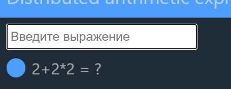
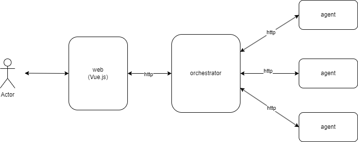
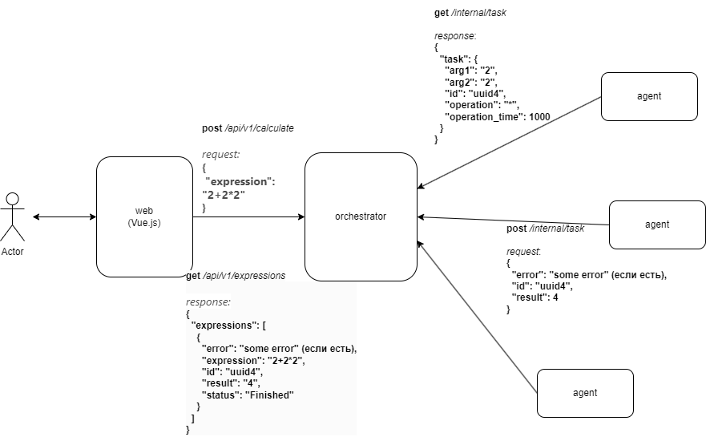

# Distributed Calculator

Распределенный вычислитель арифметических выражений

## Requirements

### Для работы проекта необходимо следущее программное обеспечение или библиотеки:

`Git`, `Docker`, `Docker Compose`.

- Для скачивания и установки `Git` перейти по ссылке https://git-scm.com/downloads, установить согласно инструкции для
  своей операционной системы.
- Для скачивания и установки `Docker` перейти по ссулке https://docs.docker.com/desktop/install/windows-install/,
  установить согласно
  инструкции для своей операционной системы.

## Installation and Usage

### Инструкции по установке и использованию

#### Docker (РЕКОМЕНДУЕМО)

1. Установить необходимое программное обеспечение и библиотеки (_смотри предыдущий раздел_).
2. Клонировать репозиторий на локальный компьютер

```bash
git clone https://github.com/VinGP/DistributedCalculator.git
```

3. Перейти в папку проекта

```bash
cd DistributedCalculator
```

4. Собрать и запустить проект командой `docker compose -f docker-cmpose.yml up --build`
5. Для остановки и удаления контейнеров и сети с компьютера набрать команду `docker compose -f docker-cmpose.yml down`

### Использование проекта

Сервер считает арифметически верно составленные выражения, состоящие из чисел, скобок и операторов "+ - * / ^"

Для проверки работы проекта необходимо, после старта проекта, в браузере открыть http://localhost/.

1. http://localhost/ - веб часть
   
2. http://localhost:8080 - API
   Для работы с запросами можно воспользоваться swagger, который доступен по
   адресу http://localhost:8080/swagger/index.html
   

Выможете проверить работу проека без установки его локально. Проект доступен по адресу https://calculator.vingp.dev/

- https://calculator.vingp.dev/ - веб часть
- https://api.calculator.vingp.dev/ - API (https://api.calculator.vingp.dev/swagger/index.html - swagger)

#### Отправка выражения

Чтобы отпрвить выражение на вычисление, ввдетите его в поле и нажмите `Enter`


После чего оно появиться в общем списке



Чтобы обновить статус выражений обновите страницу

## Схемы

### Общая схема работы проекта



### Схема вычисления



## Curl (bash)

### Запрос на вычисления выражения

Запрос

```bash
curl -X 'POST' \
  'http://localhost:8080/api/v1/calculate' \
  -H 'accept: application/json' \
  -H 'Content-Type: application/json' \
  -d '{
  "expression": "1+1*2"
}'
```

Пример ответа:

```json
{
  "expression": {
    "id": "dcf3f6d3-37d2-4c4d-aa3a-181e256c927c",
    "status": "Started",
    "expression": "1+1*2"
  }
}
```

#### Запрос на получение выражения по id

Пример запроса:

```bash
curl -X 'GET' \
  'http://localhost:8080/api/v1/expressions/dcf3f6d3-37d2-4c4d-aa3a-181e256c927c' \
  -H 'accept: application/json'
```

Примеры ответов:

#### 200

```json
{
  "expression": {
    "id": "dcf3f6d3-37d2-4c4d-aa3a-181e256c927c",
    "status": "Started",
    "expression": "1+1*2"
  }
}
```

#### 404

```json
{
  "status": "Error",
  "error": "expression not found"
}
```

#### Запрос на получение всех выражений

Пример запроса

```bash
curl -X 'GET' \
  'http://localhost:8080/api/v1/expressions' \
  -H 'accept: application/json'
```

Пример ответа

```json
{
  "expressions": [
    {
      "id": "35f19e24-353a-4843-8126-c3acd5f88248",
      "status": "Finished",
      "result": "3",
      "expression": "1+1*2"
    },
    {
      "id": "0e6aa7a3-5e59-4ffb-b7cd-99ba3423a6ac",
      "status": "Finished",
      "result": "2",
      "expression": "1+1"
    }
  ]
}
```

#### Запрос на получение задачи

Пример запроса

```bash
curl -X 'GET' \
  'http://localhost:8080/internal/task' \
  -H 'accept: application/json'
```

Примеры ответов

#### 200

```json
{
  "task": {
    "id": "b01a16ea-fba4-45e5-a993-782f91af4f1e_1_68bd5bdc-5844-47d4-9d87-2ef0c9e73e73",
    "arg1": "1",
    "arg2": "2",
    "operation": "*",
    "operation_time": 2000
  }
}
```

#### 404

```json
{
  "status": "Error",
  "error": "no tasks"
}
```

#### Запрос на завешение задачи

Пример запроса

```bash
curl -X 'POST' \
  'http://localhost:8080/internal/task' \
  -H 'accept: application/json' \
  -H 'Content-Type: application/json' \
  -d '{
  "id": "b01a16ea-fba4-45e5-a993-782f91af4f1e_1_68bd5bdc-5844-47d4-9d87-2ef0c9e73e73",
  "result": 2
}'
```

Примеры ответов

#### 200

```json
{}
```

#### 404

```json
{
  "status": "Error",
  "error": "task not found"
}
```

## Authors and Contacts

Автор: Воронин Иван

Телеграм для связи: @VinGP 