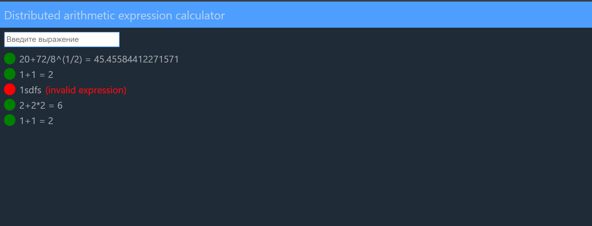
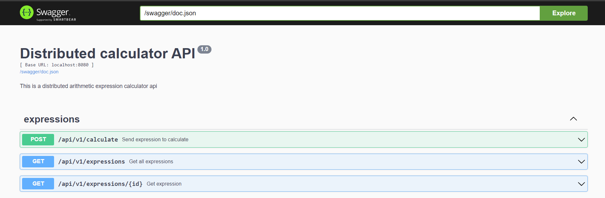

# Distributed Calculator

Распределенный вычислитель арифметических выражений

## Requirements

### Для работы проекта необходимо следущее программное обеспечение или библиотеки:

`Git`, `Docker`, `Docker Compose`.

- Для скачивания и установки `Git` перейти по ссылке https://git-scm.com/downloads, установить согласно инструкции для
  своей операционной системы.
- Для скачивания и установки `Docker` перейти по ссулке https://docs.docker.com/desktop/install/windows-install/,
  установить согласно
  инструкции для своей операционной системы.

## Installation and Usage

### Инструкции по установке и использованию

#### Docker (РЕКОМЕНДУЕМО)

1. Установить необходимое программное обеспечение и библиотеки (_смотри предыдущий раздел_).
2. Клонировать репозиторий на локальный компьютер

```bash
git clone https://github.com/VinGP/DistributedCalculator.git
```

3. Перейти в папку проекта

```bash
cd DistributedCalculator
```

4. Собрать и запустить проект командой `docker compose -f docker-cmpose.yml up --build`
5. Для остановки и удаления контейнеров и сети с компьютера набрать команду `docker compose -f docker-cmpose.yml down`

### Использование проекта

Для проверки работы проекта необходимо, после старта проекта, в браузере открыть две вкладки по указанным адресам
запуска: api-сервера (http://localhost:8080) и веб интерфейс (http://localhost/).

1. http://127.0.0.1 - веб часть
   
2. http://localhost:8080 - API
   Для работы с запросами можно воспользоваться swagger, который доступен по
   адресу http://localhost:8080/swagger/index.html
   

Выможете проверить работу проека без установки его локально. Проект доступен по адресу https://calculator.vingp.dev/

- https://calculator.vingp.dev/ - веб часть
- https://api.calculator.vingp.dev/ - API (https://calculator.vingp.dev/swagger/index.html - swagger)

## Authors and Contacts
Автор: Воронин Иван

Телеграм для связи: @VinGP 